# 🛍️ Customer Shopping Behaviour Analysis


---
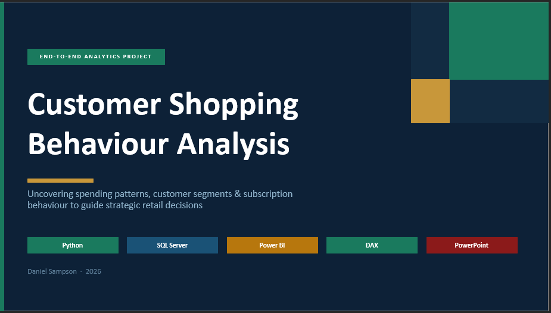

## 📌 Project Overview

This is a full end-to-end data analytics project analysing the shopping behaviour of **3,900 retail customers** across product categories, seasons, demographics, payment methods, and subscription status.

The project follows a complete analytics pipeline — raw data ingestion and exploration in Python, structured business question analysis in Microsoft SQL Server, an interactive 2-page Power BI dashboard published to Power BI Service, and a stakeholder-ready PowerPoint presentation. The goal was to uncover **actionable insights** into spending patterns, customer segments, product preferences, discount dependency, and subscription behaviour to guide strategic business decisions.

---

## 🚨 Business Problem

The business needed answers to the following questions:

- Which product categories and seasons generate the most revenue?
- Why is the subscription rate critically low at 27%?
- How does customer behaviour differ by gender and age group?
- Which customer segments have the highest lifetime value?
- What shipping and payment preferences do customers have?

---

## 🗂️ Table of Contents

1. [Dataset Summary](#-dataset-summary)
2. [Tools & Technologies](#️-tools--technologies)
3. [Project Pipeline](#-project-pipeline)
4. [Exploratory Data Analysis — Python](#-step-1--exploratory-data-analysis-python)
5. [SQL Analysis](#-step-2--business-analysis-microsoft-sql-server)
6. [Power BI Dashboard](#-step-3--interactive-dashboard-power-bi)
7. [Key Findings](#-key-findings)
8. [Business Recommendations](#-business-recommendations)
9. [Project Structure](#-project-structure)
10. [How to Run](#-how-to-run-this-project)

---

## 📊 Dataset Summary

| Property | Detail |
|---|---|
| Source | Retail customer transactional dataset |
| Rows | 3,900 |
| Columns | 18 |
| Missing Data | 37 null values in `Review Rating` column |

### Feature Categories

| Group | Columns |
|---|---|
| **Customer Demographics** | `Customer ID`, `Age`, `Gender`, `Location`, `Subscription Status` |
| **Purchase Details** | `Item Purchased`, `Category`, `Purchase Amount (USD)`, `Season`, `Size`, `Color` |
| **Shopping Behaviour** | `Discount Applied`, `Promo Code Used`, `Previous Purchases`, `Frequency of Purchases`, `Review Rating`, `Shipping Type`, `Payment Method` |
| **Engineered Features** | `age_group`, `purchase_frequency_days` |

---

## 🛠️ Tools & Technologies

| Tool | Purpose |
|---|---|
| **Python** (Pandas) | Data loading, exploration, cleaning, feature engineering |
| **SQLAlchemy + pyodbc** | Python → SQL Server connection and data load |
| **Microsoft SQL Server** | Business question analysis via T-SQL |
| **Power BI + DAX** | Interactive 2-page dashboard |
| **Power BI Service** | Cloud publishing for sharing and collaboration |
| **PowerPoint** | Stakeholder presentation (exported as PDF) |
| **GitHub** | Version control and portfolio sharing |

---

## ⚙️ Project Pipeline

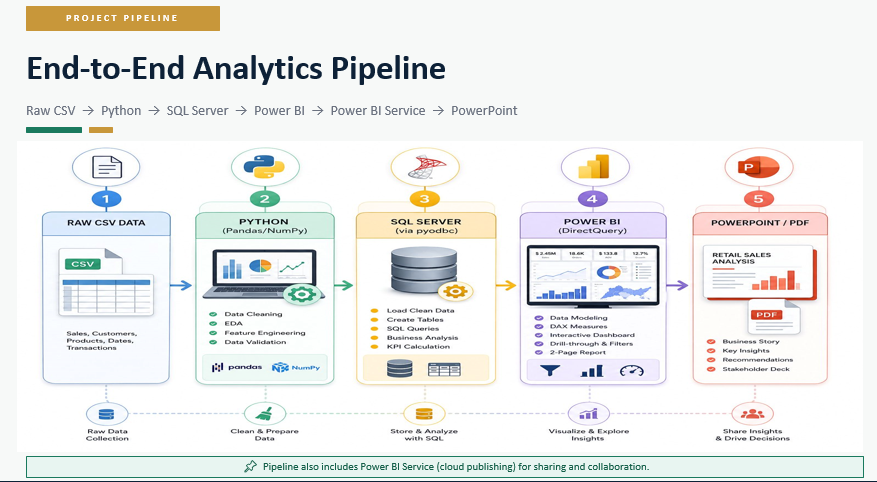


The initial exploration revealed:
- **3,900 rows, 18 columns** of retail transactional data
- **37 null values** exclusively in the `Review Rating` column (~0.95%)
- Customer ages ranging from **18 to 70**, average age **44**
- Purchase amounts from **$20 to $100**, average **$59.76**
- Most frequent gender: **Male (2,652 — 68%)** vs Female (1,248 — 32%)
- **73% of customers are unsubscribed** — a critical churn signal

### 1.2 Missing Data Handling

Missing ratings were imputed using the **median rating per product category** to preserve category-specific behaviour rather than applying a global average:

```python
df['Review Rating'] = df.groupby('Category')['Review Rating'].transform(
    lambda x: x.fillna(x.median())
)

# Confirm all nulls resolved
df.isnull().sum()
```

### 1.3 Column Standardisation

All column names were converted to **snake_case** for consistency across Python, SQL Server, and Power BI:

```python
df.columns = df.columns.str.lower()
df.columns = df.columns.str.replace(' ', '_')
df = df.rename(columns={'purchase_amount_(usd)': 'purchase_amount'})
```

### 1.4 Feature Engineering

**Age Group** — customers were binned into four demographic segments using quartile-based discretisation to ensure balanced group sizes:

```python
labels = ['Young Adult', 'Adult', 'Middle Aged', 'Senior']
df['age_group'] = pd.qcut(df['age'], q=4, labels=labels)
```

**Purchase Frequency Days** — the categorical frequency column was mapped to numeric days to enable quantitative analysis:

```python
frequency_mapping = {
    'Weekly'        : 7,
    'Fortnightly'   : 14,
    'Bi-Weekly'     : 14,
    'Monthly'       : 30,
    'Quarterly'     : 90,
    'Every 3 Months': 90,
    'Annually'      : 365
}

df['purchase_frequency_days'] = df['frequency_of_purchases'].map(frequency_mapping)
```

### 1.5 Data Consistency Check

A logical check was performed to verify whether `discount_applied` and `promo_code_used` carried identical information:

```python
# Check side by side
df[['discount_applied', 'promo_code_used']].head(10)

# Verify if 100% identical
(df['discount_applied'] == df['promo_code_used']).all()  # Returns: True
```

Since both columns were **100% identical across all 3,900 rows**, `promo_code_used` was safely dropped:

```python
df = df.drop(columns='promo_code_used', axis=1)
```

### 1.6 Export & SQL Server Integration

The cleaned DataFrame was exported as CSV and simultaneously loaded into **Microsoft SQL Server** using SQLAlchemy and pyodbc:

```python
from sqlalchemy import create_engine
import urllib

# Connection parameters
SERVER   = r'DESKTOP-JJFIAGN\SQLEXPRESS'
DATABASE = 'Customer_Behaviour'
DRIVER   = 'ODBC Driver 17 for SQL Server'

# Build and encode connection string (Windows Authentication)
connection_string = (
    f'DRIVER={{{DRIVER}}};SERVER={SERVER};'
    f'DATABASE={DATABASE};Trusted_Connection=yes;'
)
params = urllib.parse.quote_plus(connection_string)
engine = create_engine(f'mssql+pyodbc:///?odbc_connect={params}')

# Test connection
try:
    with engine.connect() as connection:
        print("Successfully connected to MS SQL Server!")
except Exception as e:
    print(f"Connection failed: {e}")

# Load DataFrame into SQL Server
table_name = 'customer_data'
try:
    df.to_sql(name=table_name, con=engine, if_exists='replace', index=False)
    print(f"Success! The table '{table_name}' has been exported to SQL Server.")
except Exception as e:
    print(f"Error exporting data: {e}")
```

---

## 🗄️ Step 2 — Business Analysis (Microsoft SQL Server)

With the cleaned data loaded into SQL Server, **10 business questions** were answered using T-SQL — covering subqueries, CTEs, window functions, and conditional aggregations.

---

### Q1. What is the total revenue generated by male vs. female customers?

```sql
SELECT
    gender,
    SUM(purchase_amount) AS revenue
FROM customer_data
GROUP BY gender;
```

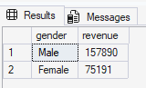

> Male customers generate **2.1× more revenue** than female customers, directly reflecting the 68/32 gender split in the customer base.

---

### Q2. Which customers used a discount but still spent above the average purchase amount?

```sql
SELECT
    customer_id,
    purchase_amount
FROM customer_data
WHERE discount_applied = 'Yes'
    AND purchase_amount > (SELECT AVG(purchase_amount) FROM customer_data);
```
> **839 customers** applied a discount yet still spent above the $59.76 average — high-value, deal-motivated buyers worth targeting with premium loyalty offers.

---

### Q3. Which are the top 5 products by average review rating?

```sql
SELECT TOP 5
    item_purchased,
    CAST(AVG(review_rating) AS DECIMAL(5,2)) AS avg_review_rating
FROM customer_data
GROUP BY item_purchased
ORDER BY AVG(review_rating) DESC;
```
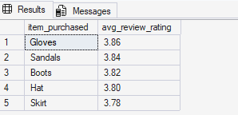


### Q4. Compare average purchase amounts between Standard and Express shipping

```sql
SELECT
    shipping_type,
    AVG(purchase_amount) AS avg_purchase_amount
FROM customer_data
WHERE shipping_type IN ('Standard', 'Express')
GROUP BY shipping_type;
```

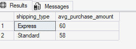

> Express shipping customers spend **$2 more on average** — a signal of higher purchase intent worth targeting with premium offerings.

---

### Q5. Do subscribed customers spend more than non-subscribers?

```sql
SELECT
    subscription_status,
    COUNT(customer_id)   AS total_customers,
    AVG(purchase_amount) AS avg_spend,
    SUM(purchase_amount) AS total_revenue
FROM customer_data
GROUP BY subscription_status;
```
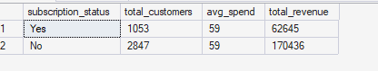

> Both groups spend virtually the same per transaction. However non-subscribers account for **73% of total revenue** — a major retention and conversion risk.

---

### Q6. Which 5 products have the highest discount dependency?

```sql
SELECT TOP 5
    item_purchased,
    CAST(
        COUNT(CASE WHEN discount_applied = 'Yes' THEN 1 END) * 100.0 / COUNT(*)
    AS DECIMAL(5,2)) AS discount_rate
FROM customer_data
GROUP BY item_purchased
ORDER BY discount_rate DESC;
```
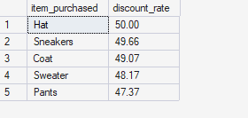

> These products rely on discounts for nearly **half of all purchases** — signalling weak standalone perceived value or poor price positioning.

---

### Q7. Segment customers into New, Returning, and Loyal

```sql
WITH segment_data AS (
    SELECT
        customer_id,
        previous_purchases,
        CASE
            WHEN previous_purchases <= 1             THEN 'New'
            WHEN previous_purchases BETWEEN 2 AND 10 THEN 'Returning'
            ELSE                                          'Loyal'
        END AS customer_segment
    FROM customer_data
)
SELECT
    customer_segment,
    COUNT(customer_id)      AS total_customers,
    SUM(previous_purchases) AS total_prev_purchase
FROM segment_data
GROUP BY customer_segment;
```

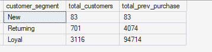

> **80% of the customer base is already Loyal** — an exceptional retention foundation. The priority is converting the 701 Returning customers upward.

---

### Q8. What are the top 3 most purchased products within each category?

```sql
WITH item_count AS (
    SELECT
        category,
        item_purchased,
        COUNT(customer_id) AS total_orders,
        ROW_NUMBER() OVER (
            PARTITION BY category
            ORDER BY COUNT(customer_id) DESC
        ) AS item_rank
    FROM customer_data
    GROUP BY category, item_purchased
)
SELECT
    category,
    item_purchased,
    total_orders,
    item_rank
FROM item_count
WHERE item_rank <= 3;
```
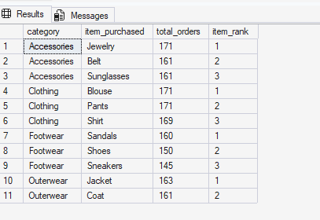
---

### Q9. Are repeat buyers (>5 purchases) more likely to subscribe?

```sql
SELECT
    subscription_status,
    COUNT(customer_id) AS repeated_buyers
FROM customer_data
WHERE previous_purchases > 5
GROUP BY subscription_status;
```
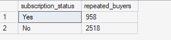

> Even among repeat buyers, **72% remain unsubscribed** — the issue is not engagement, it is the lack of compelling subscription value.

---

### Q10. What is the revenue contribution of each age group?

```sql
SELECT
    age_group,
    SUM(purchase_amount) AS revenue_contribution
FROM customer_data
GROUP BY age_group
ORDER BY revenue_contribution DESC;
```
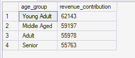

> Revenue is **spread remarkably evenly** across all age groups — no single demographic dominates, meaning broad multi-segment marketing is more effective than hyper-targeting.

---

## 📊 Step 3 — Interactive Dashboard (Power BI)

The cleaned SQL Server data was connected directly to Power BI Desktop. DAX measures were written and a **2-page interactive dashboard** was built, then published to **Power BI Service** for cloud access and sharing.

### DAX Measures

```dax
Total Customers = COUNTROWS(customer_data)

Total Revenue = SUM(customer_data[purchase_amount])

Avg Purchase Amount = AVERAGE(customer_data[purchase_amount])

Avg Review Rating = AVERAGE(customer_data[review_rating])

Subscription Rate =
DIVIDE(
    COUNTROWS(FILTER(customer_data, customer_data[subscription_status] = "Yes")),
    COUNTROWS(customer_data)
) * 100

Avg CLV =
AVERAGEX(
    customer_data,
    customer_data[previous_purchases] * customer_data[purchase_amount]
)
```

### Page 1 — Overview

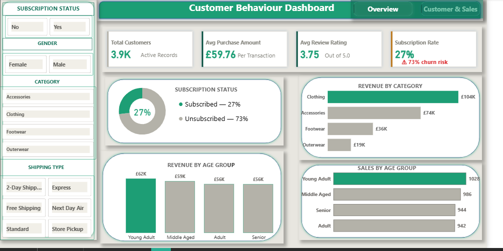

**Visuals:** KPI cards (Total Customers · Avg Purchase Amount · Avg Review Rating · Subscription Rate with ⚠ 73% churn risk alert) · Subscription Status donut chart · Revenue by Category · Revenue by Age Group · Sales by Age Group

**Slicers:** Subscription Status · Gender · Category · Shipping Type

### Page 2 — Customer & Sales Insights

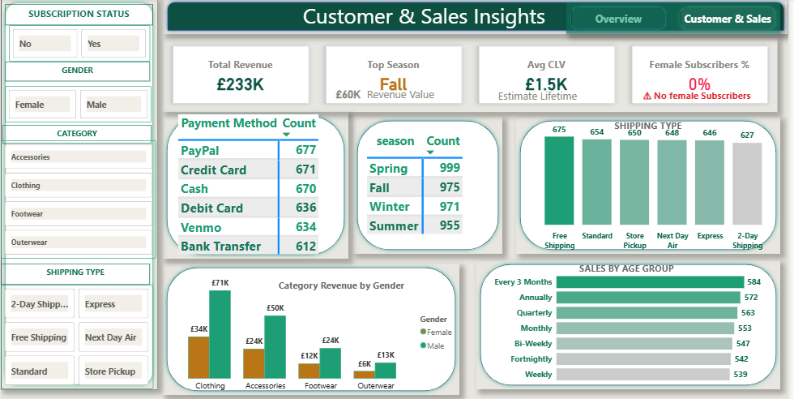

**Visuals:** KPI cards (Total Revenue · Top Season · Avg CLV · Female Subscriber % with 0% alert) · Payment Method count table · Revenue by Season · Shipping Type usage · Category Revenue by Gender · Sales by Age Group (purchase frequency)

**Navigation:** Custom page navigation buttons in the header — Overview ↔ Customer & Sales

...

> 🔗 **[View Live Dashboard on Power BI Service](https://app.powerbi.com/view?r=eyJrIjoiMDFjZTc1MTgtNjEzMC00ZmRjLThjMzctMTY3NDZlYTFhMDE5IiwidCI6IjJmY2Q2MDIxLTI1NjEtNDM5Yy1hN2JmLWFlNmUxOGYyNzQ5MSJ9)**


---

## 📌 Key Findings

| # | Finding | Detail |
|---|---|---|
| 1 | 🔴 Critical churn risk | 73% of customers (2,847) are unsubscribed |
| 2 | ⚠️ Zero female subscriptions | 0% of female customers have subscribed |
| 3 | 🏆 80% Loyal customer base | 3,116 of 3,900 have 10+ previous purchases |
| 4 | 💰 Clothing dominates revenue | £104K — 45% of £233K total |
| 5 | 🔁 Repeat buyers still don't subscribe | 72% of repeat buyers remain unsubscribed |
| 6 | 📦 Express shipping premium | Express users spend $2 more per transaction |
| 7 | 🎯 839 high-value discount users | Spend above average even while discounting |
| 8 | 🏷️ Hat has 50% discount dependency | Highest of any product — margin risk |
| 9 | 👥 Revenue evenly spread by age | Young Adult leads at £62K, Senior at £56K |
| 10 | 🛒 Fortnightly buyers are most frequent | Largest purchase frequency segment at 614 |

---

## 💡 Business Recommendations

**1. Fix the Subscription Programme**
73% of customers are unsubscribed and even 72% of repeat buyers have not converted — the programme lacks compelling value. Introduce exclusive subscriber benefits (early access, free shipping, personalised discounts) and run a targeted re-engagement campaign for the 2,847 unsubscribed customers.

**2. Urgently Address the Female Subscription Gap**
Zero female customers are subscribed. This is not coincidence — investigate whether the subscription offering, communication channels, or product alignment is failing to resonate with female shoppers. A gender-targeted subscription trial could unlock significant untapped revenue.

**3. Convert Returning Customers to Loyal (701 customers)**
With 80% already Loyal, the 701 Returning customers represent the clearest growth path. A structured loyalty ladder with milestone rewards after the 5th purchase could efficiently move this group upward.

**4. Maximise Fall and Spring Marketing Spend**
Fall (£60K) and Spring (£59K) are the top two revenue seasons. Concentrate product launches, promotions, and influencer activity in these windows for maximum return on marketing investment.

**5. Re-evaluate Discount Strategy for High-Dependency Products**
Hat (50%), Sneakers (49.7%), and Coat (49.1%) rely on discounts for nearly half of all purchases. This signals weak standalone demand. Consider repositioning, bundling, or quality improvements rather than continuing to erode margins.

**6. Create a Premium Tier for the 839 High-Spending Discount Users**
These customers spend above average even when using discounts — they have strong purchase intent. Move them into a premium loyalty tier with personalised high-value offers rather than blanket discounts.

**7. Leverage Express Shipping Users with Premium Lines**
Express shipping customers spend $2 more per transaction on average. Promote premium product lines and bundles specifically to this segment — they have demonstrated a consistent willingness to pay more.

---

## 📁 Project Structure

```
customer-shopping-behaviour-analysis/
│
├── 📂 assets/
│   ├── workflow_diagram.png              # End-to-end pipeline diagram
│   ├── dashboard_screenshot_p1.png       # Power BI — Page 1 screenshot
│   └── dashboard_screenshot_p2.png       # Power BI — Page 2 screenshot
│
├── 📂 data/
│   ├── customer_shopping_behavior.csv    # Raw dataset
│   └── customer_data.csv                 # Cleaned dataset (Python output)
│
├── 📂 python/
│   ├── 01_eda.ipynb                      # Initial exploration & summary statistics
│   ├── 02_data_cleaning.ipynb            # Missing values · standardisation · redundancy check
│   └── 03_feature_engineering.ipynb      # age_group · purchase_frequency_days · SQL Server load
│
├── 📂 sql/
│   └── customer_behavior_sql_queries.sql # 10 business questions (T-SQL)
│
├── 📂 powerbi/
│   └── Customer_Behaviour_Dashboard.pbix # Power BI dashboard file
│
├── 📂 presentation/
│   └── Customer_Shopping_Behaviour_Analysis.pdf
│
└── README.md
```

---

## 🚀 How to Run This Project

### Prerequisites

```bash
pip install pandas pyodbc sqlalchemy
```

### Steps

1. Clone the repository

```bash
git clone https://github.com/DanielSampson/customer-shopping-behaviour-analysis.git
cd customer-shopping-behaviour-analysis
```

2. Run the Python notebooks in order

```
01_eda.ipynb                → explore the raw data
02_data_cleaning.ipynb      → clean and standardise
03_feature_engineering.ipynb → engineer features + load into SQL Server
```

> **Note:** Update the `SERVER` and `DATABASE` variables in `03_feature_engineering.ipynb` to match your local SQL Server instance before running the SQL load cell.

3. Run the SQL queries

```
Open sql/customer_behavior_sql_queries.sql in SQL Server Management Studio (SSMS)
Run against the Customer_Behaviour database
```

4. Open the Power BI dashboard

```
Open 'powerbi/Customer_Behaviour_Dashboard.pbix' in Power BI Desktop
Refresh the data source connection to point to your SQL Server instance
```

---

## 📬 Contact

**Daniel Sampson**

- 🔗 LinkedIn: [Daniel_Sampson](https://www.linkedin.com/in/daniel-sampson-35b4b4366/
)
- 🐙GitHub:  [Daniel_Sampson](https://github.com/DanielSampson)
- Email: 📧 dannysam123t@gmail.com

---

*If you found this project useful, give it a ⭐ on GitHub!*
